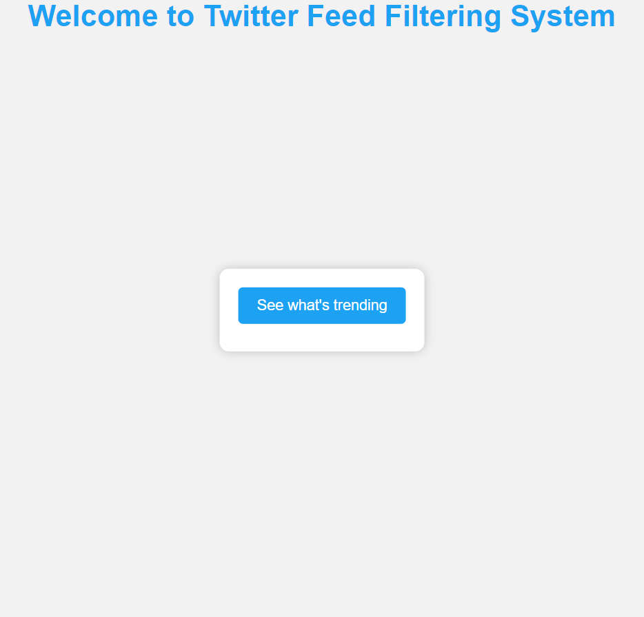
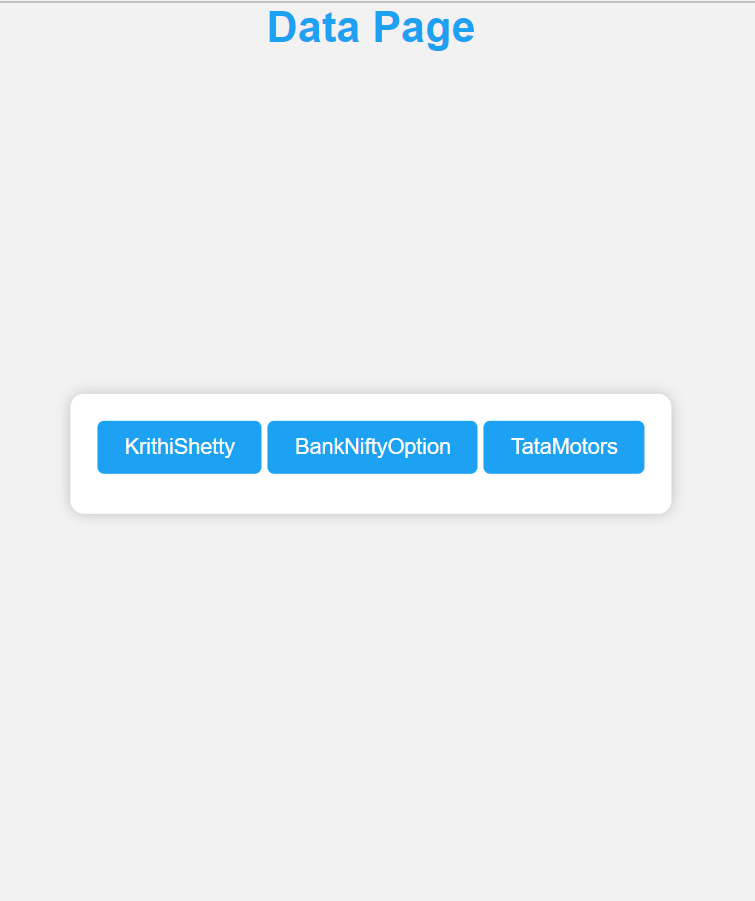
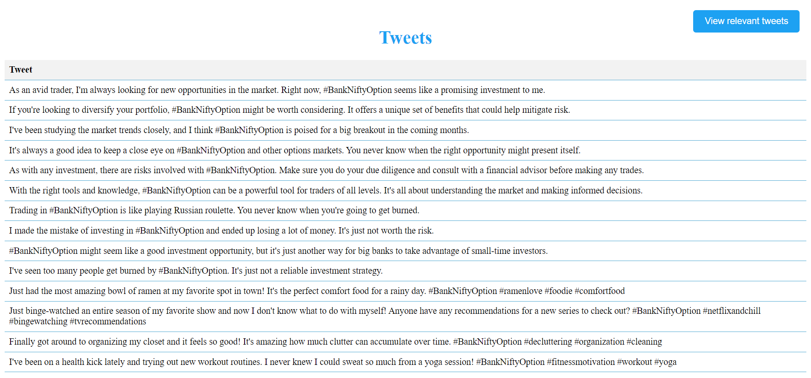
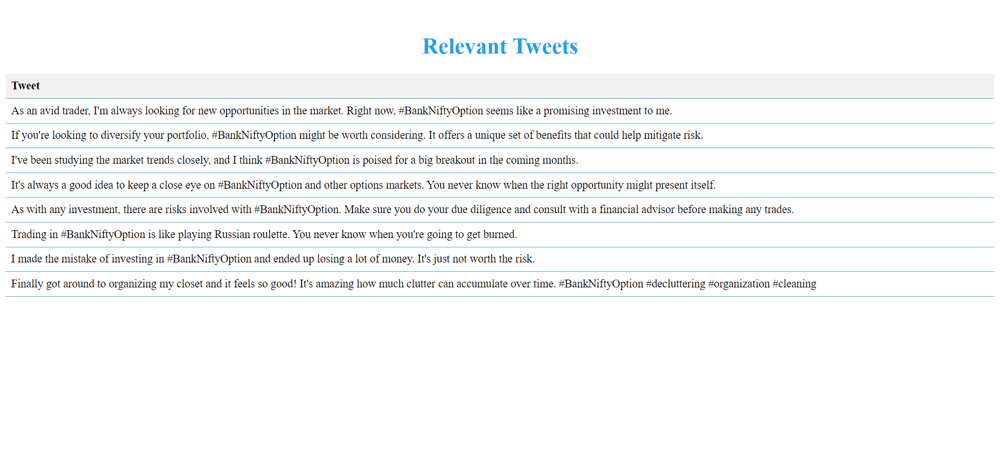

# Twitter-Feed-Filter
The application is made using flask framework.
* Install the neccessary packages and dependencies by running ``pip install -r requirements.txt``
* Run it using the command ``flask run`` or ``python app.py``.
* The application runs on ``127.0.0.1`` on port ``5000``.
* For running the Machine Learning model route to ``/test`` and the process is completed when the message show is 
{200: OK}.
* Then go the ``View relevant tweets`` button and view the tweets relevant to the trend.
## Snapshots

